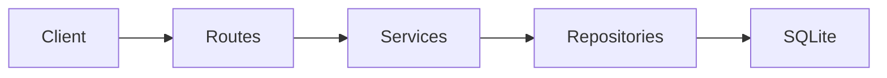

# Tech Spec: gs-workshop-vaquita-b

## Overview
The API is implemented as a small layered Express application backed by SQLite via
`better-sqlite3`. HTTP routes validate requests with Zod, delegate to services for
business rules, and use repositories for all persistence. The MVP focuses on the full
tanda lifecycle: users, tandas, participants, contributions, and round progression.

## Architecture
### System Diagram

### Tech Stack
- Runtime: typescript
- Framework: Express
- Database: SQLite via better-sqlite3
- Validation: Zod
- Auth: environment-backed JWT signing

### Data Flow
1. Request enters Express route
2. Zod validates body/query/path input at the boundary
3. Route delegates to a service
4. Service applies domain and authorization rules
5. Repository reads/writes SQLite
6. Route returns `{ data, meta, errors }` envelope

## API Contracts
Implemented endpoints:

- `POST /api/users`
- `GET /api/users`
- `GET /api/users/:id`
- `POST /api/tandas`
- `GET /api/tandas`
- `GET /api/tandas/:id`
- `POST /api/tandas/:id/join`
- `POST /api/tandas/:id/start`
- `POST /api/tandas/:id/cancel`
- `GET /api/tandas/:id/participants`
- `POST /api/tandas/:id/contributions`
- `GET /api/tandas/:id/rounds/:round`
- `POST /api/tandas/:id/advance`
- `GET /api/tandas/:id/participants/:pid/history`

The same contract is also mounted under `/api/v1`.

## Security & Compliance
- JWT secret comes only from environment configuration
- Bearer token identity is checked against explicit actor ids when both are present
- Standard security headers are set on every response
- Simple in-memory rate limiting is applied per IP
- Money is stored in integer minor units, not floating-point DB values

## Dependencies
- `express`
- `better-sqlite3`
- `zod`
- `uuid`
- `typescript`
- `tsx`

## Risks & Mitigations
| Risk | Likelihood | Impact | Mitigation |
|------|-----------|--------|------------|
| Native SQLite module may require platform-specific rebuild | M | H | Run `npm install` in the target runtime before boot |
| Workshop spec uses explicit ids while standards prefer token auth | M | M | Accept both, require they match when both are present |
| No automated tests yet in this MVP pass | H | M | Add Vitest + supertest coverage in the next phase |
