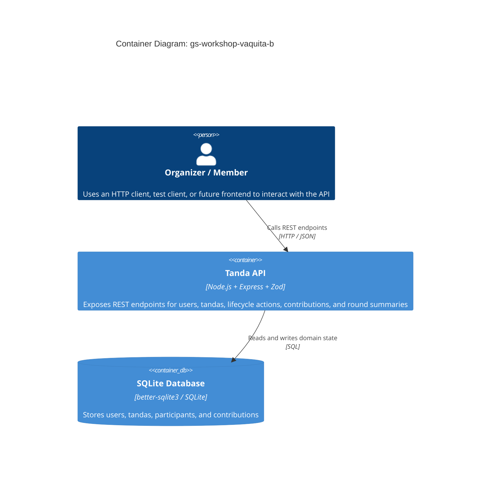

# Container Diagram — gs-workshop-vaquita-b

```mermaid
C4Container
    title Container Diagram: gs-workshop-vaquita-b

    Person(user, "Organizer / Member", "Uses an HTTP client, test client, or future frontend to interact with the API")

    Container(api, "Tanda API", "Node.js + Express + Zod", "Exposes REST endpoints for users, tandas, lifecycle actions, contributions, and round summaries")
    ContainerDb(db, "SQLite Database", "better-sqlite3 / SQLite", "Stores users, tandas, participants, and contributions")

    Rel(user, api, "Calls REST endpoints", "HTTP / JSON")
    Rel(api, db, "Reads and writes domain state", "SQL")
```
