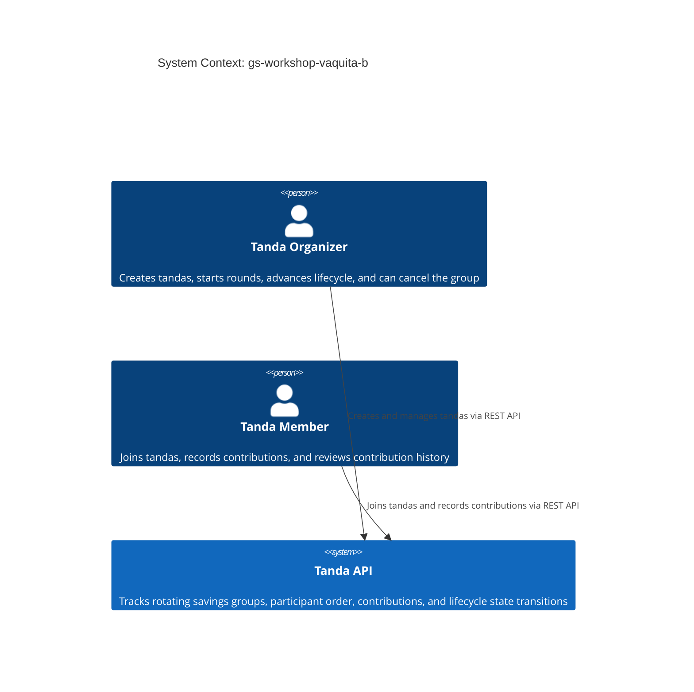

# System Context Diagram

```mermaid
C4Context
  title System Context: gs-workshop-vaquita-b
  Person(organizer, "Tanda Organizer", "Creates tandas, starts rounds, advances lifecycle, and can cancel the group")
  Person(member, "Tanda Member", "Joins tandas, records contributions, and reviews contribution history")
  System(system, "Tanda API", "Tracks rotating savings groups, participant order, contributions, and lifecycle state transitions")

  Rel(organizer, system, "Creates and manages tandas via REST API")
  Rel(member, system, "Joins tandas and records contributions via REST API")
```
