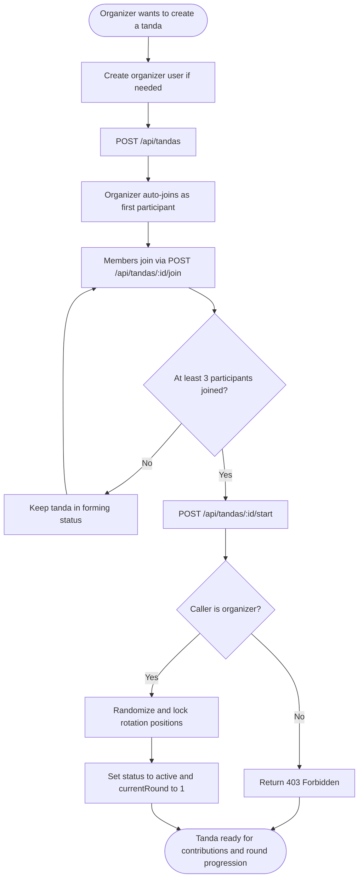

# Flow: UC-01 Organizer Creates and Starts a Tanda

```mermaid
flowchart TD
    Start([Organizer wants to create a tanda])

    Start --> CreateUser[Create organizer user if needed]
    CreateUser --> CreateTanda[POST /api/tandas]
    CreateTanda --> AutoJoin[Organizer auto-joins as first participant]
    AutoJoin --> MoreMembers[Members join via POST /api/tandas/:id/join]
    MoreMembers --> Validate{At least 3 participants joined?}

    Validate -->|No| Wait[Keep tanda in forming status]
    Wait --> MoreMembers

    Validate -->|Yes| StartTanda[POST /api/tandas/:id/start]
    StartTanda --> OrganizerCheck{Caller is organizer?}

    OrganizerCheck -->|No| Forbidden[Return 403 Forbidden]
    Forbidden --> End([Request rejected])

    OrganizerCheck -->|Yes| Randomize[Randomize and lock rotation positions]
    Randomize --> Activate[Set status to active and currentRound to 1]
    Activate --> End([Tanda ready for contributions and round progression])
```
