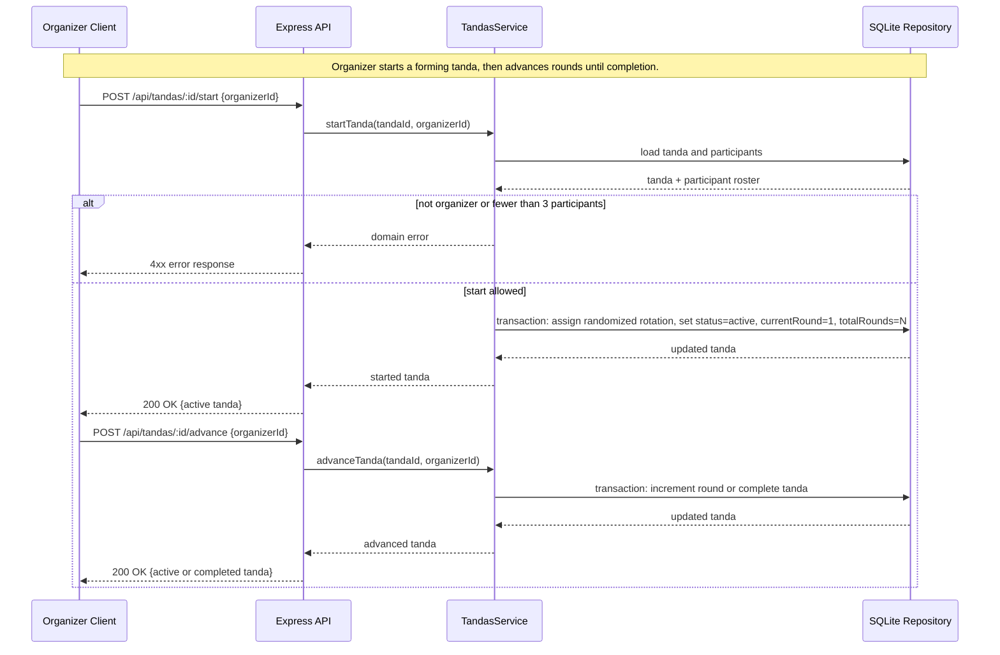

# Sequence Diagram: Organizer Starts and Advances a Tanda

```mermaid
sequenceDiagram
    participant Organizer as Organizer Client
    participant API as Express API
    participant Service as TandasService
    participant Store as SQLite Repository

    Note over Organizer,Store: Organizer starts a forming tanda, then advances rounds until completion.

    Organizer->>API: POST /api/tandas/:id/start {organizerId}
    API->>Service: startTanda(tandaId, organizerId)
    Service->>Store: load tanda and participants
    Store-->>Service: tanda + participant roster

    alt not organizer or fewer than 3 participants
        Service-->>API: domain error
        API-->>Organizer: 4xx error response
    else start allowed
        Service->>Store: transaction: assign randomized rotation, set status=active, currentRound=1, totalRounds=N
        Store-->>Service: updated tanda
        Service-->>API: started tanda
        API-->>Organizer: 200 OK {active tanda}

        Organizer->>API: POST /api/tandas/:id/advance {organizerId}
        API->>Service: advanceTanda(tandaId, organizerId)
        Service->>Store: transaction: increment round or complete tanda
        Store-->>Service: updated tanda
        Service-->>API: advanced tanda
        API-->>Organizer: 200 OK {active or completed tanda}
    end
```
