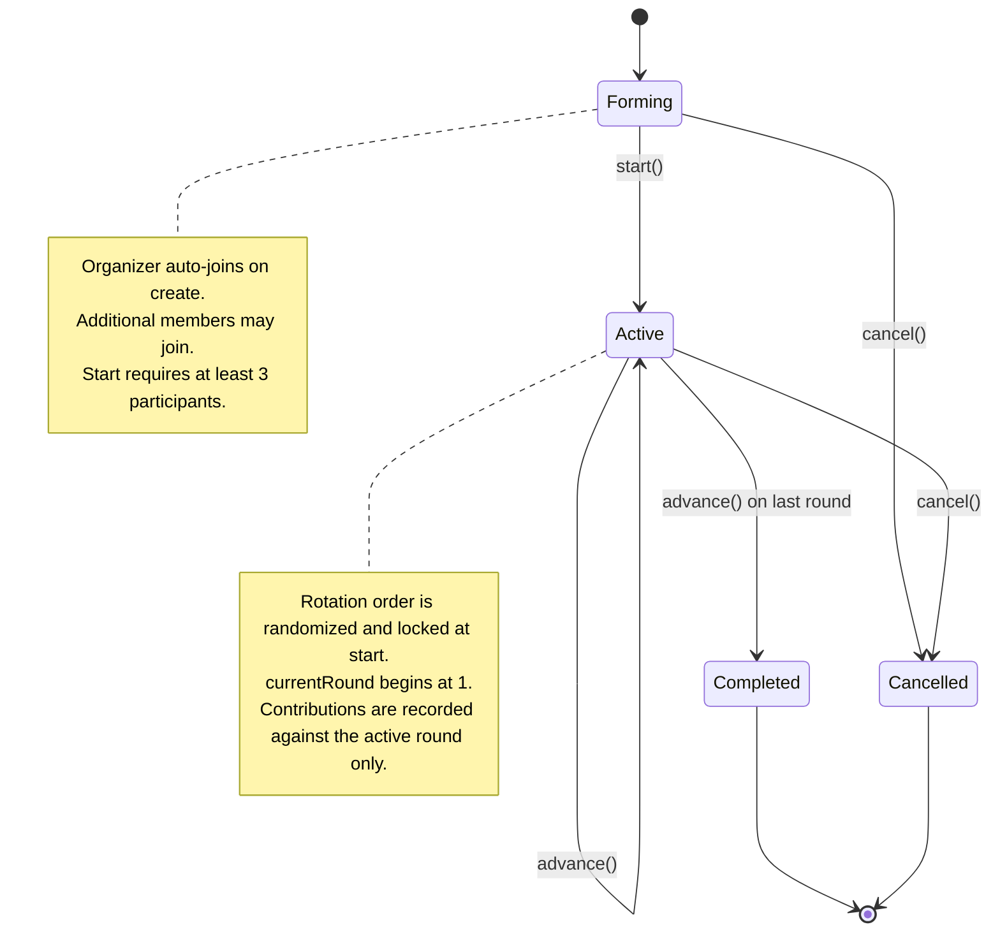

# State Machine: Tanda Lifecycle

```mermaid
stateDiagram-v2
    [*] --> Forming

    Forming --> Active: start()
    Forming --> Cancelled: cancel()
    Active --> Active: advance()
    Active --> Completed: advance() on last round
    Active --> Cancelled: cancel()

    Completed --> [*]
    Cancelled --> [*]

    note right of Forming
        Organizer auto-joins on create.
        Additional members may join.
        Start requires at least 3 participants.
    end note

    note right of Active
        Rotation order is randomized and locked at start.
        currentRound begins at 1.
        Contributions are recorded against the active round only.
    end note
```
